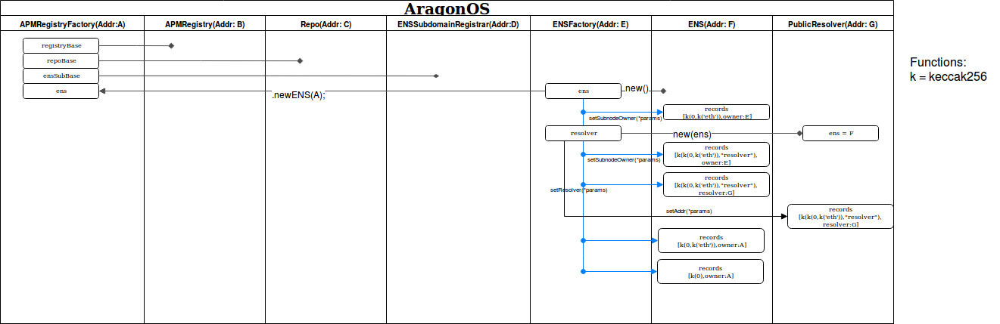

#AragonOS Tecnical details

Version history: 0.1 

Date: January 11, 2018 

## AragonOS 
### *Version 0.1*

Aragon presents an installation scheme  similar to Ubuntu for setting up the kernel and its permissioning system. Doing an anology between these systems,  when the booting disk runs for first time the system there is a super user (APMRegistryFactory in Aragon) that generates the permissions for the kernel to install the packtages. At the end of the installation process the permissions will be assigned to the end user (the owner address who deploys for the eth domain).

